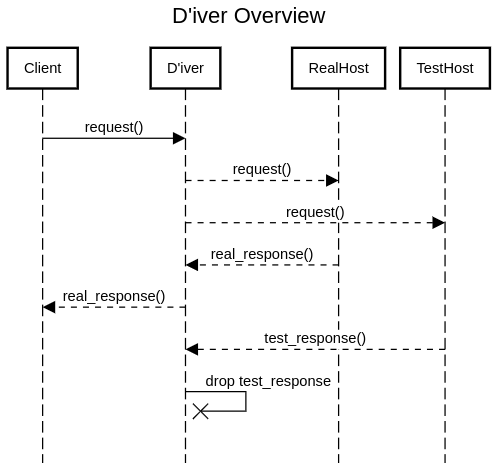

# D'iver

[D'iver](https://malazan.fandom.com/wiki/D%27ivers) acts a Divider proxy for a TCP stream.

It will send all TCP traffic it receives to two different endpoints (designated 'real'
and 'test'). The response from the 'real' endpoint is returned upstream to the client,
and the 'test' response is dropped.

This allows for direct, live comparison of the effect on an application when introducing new
features, bug fixes, optimizations, etc.

# Overview


# Usage
* Create a `config.yaml` file:
```yaml
real: real.endpoint.com:80
test: test.endpoint.com:80
port: 80
buffer_size_bytes: 2048
```
* Run the binary:
`./target/release/diver`
* Point clients at the IP address + port of the current machine
